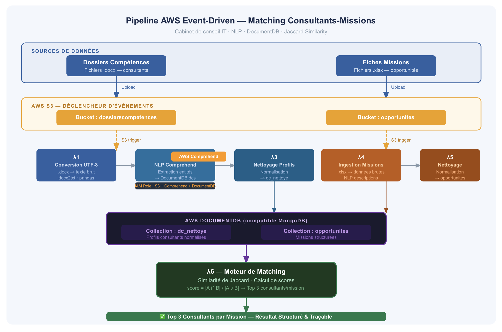
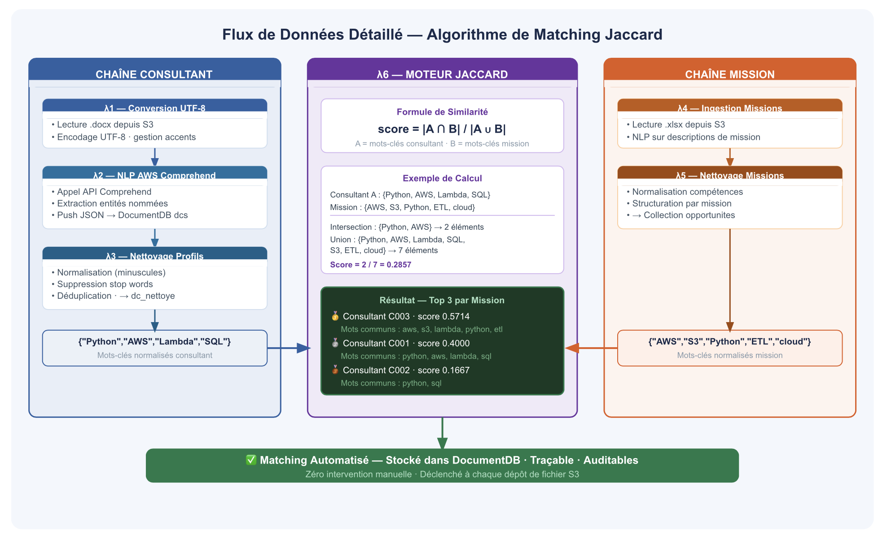

# aws-nlp-consultant-matching
Event-driven AWS pipeline for consultant-mission matching using NLP and Jaccard similarity


# Pipeline AWS de Matching Consultants-Missions — Architecture Event-Driven & NLP
 
> **Contexte :** Outil interne conçu pour un cabinet de conseil IT français (~100 consultants) afin d'automatiser le matching entre les profils consultants et les missions clients — processus entièrement manuel remplacé par un pipeline AWS en production.
> **Rôle :** Data Engineer — conception de l'architecture, déploiement des fonctions Lambda, traitement NLP, stockage DocumentDB, mise en production
> **Année :** 2023 | **Statut :** POC → Production
 
---
 
## Problème Métier
 
Le cabinet gérait plusieurs dizaines de consultants en intercontrat. Chaque semaine, une équipe croisait manuellement les dossiers de compétences (fichiers Word) avec les fiches de missions clients (fichiers Excel) — processus lent, source d'erreurs, et cause directe de délais dans les démarrages de mission.
 
**Deux objectifs centraux :**
1. Maximiser l'utilisation des compétences disponibles dans le vivier consultants
2. Réduire les périodes d'inactivité entre deux missions
 
**Avant le pipeline :**
- Matching 100% manuel → plusieurs heures par semaine
- Risque d'oubli ou d'erreur de sélection
- Pas de traçabilité des décisions de matching
 
**Après le pipeline :**
- Matching automatisé déclenché à chaque dépôt de document
- Top 3 consultants identifiés par mission en quelques secondes
- Résultats stockés et traçables dans DocumentDB
 
---
 
## Architecture Globale
 

 
L'architecture repose sur un pattern **event-driven** : chaque dépôt de fichier dans S3 déclenche automatiquement une chaîne de traitements Lambda sans intervention humaine.
 
```
Sources (.docx / .xlsx)
        │
        ▼
    AWS S3 (stockage déclencheur)
        │
        ├──► Chaîne Consultant (Lambda 1→2→3)
        │         │
        │    Extraction NLP (Comprehend)
        │    Nettoyage + structuration
        │         │
        │         ▼
        │    DocumentDB (profils consultants)
        │
        └──► Chaîne Mission (Lambda 4→5)
                  │
             Ingestion + nettoyage
                  │
                  ▼
             DocumentDB (opportunités)
                  │
                  ▼
             Lambda 6 — Moteur de Matching (Jaccard)
                  │
                  ▼
             Top 3 consultants par mission
```
 
---
 
## Flux de Données Détaillé
 

 
### Chaîne Consultant
 
| Étape | Fonction | Entrée | Sortie |
|-------|----------|--------|--------|
| 1 | Conversion UTF-8 | `.docx` S3 | Texte brut encodé |
| 2 | Extraction NLP | Texte brut | Entités JSON → DocumentDB `dcs` |
| 3 | Nettoyage profils | Collection `dcs` | Profils normalisés → `dc_nettoye` |
 
### Chaîne Mission
 
| Étape | Fonction | Entrée | Sortie |
|-------|----------|--------|--------|
| 4 | Ingestion missions | `.xlsx` S3 | Données brutes missions |
| 5 | Nettoyage missions | Données brutes | Missions structurées → `opportunites` |
 
### Matching
 
| Étape | Fonction | Entrée | Sortie |
|-------|----------|--------|--------|
| 6 | Moteur Jaccard | `dc_nettoye` + `opportunites` | Top 3 consultants/mission |
 
---
 
##  Exemple de Code — Moteur de Matching
 
> (i) Le code ci-dessous est une **implémentation de démonstration** illustrant la logique du moteur. Il ne s'agit pas du code de production déployé.
 
```python
from typing import List, Dict
 
def normaliser_mots_cles(mots: List[str]) -> set:
    stop_words = {"le", "la", "les", "de", "du", "des", "et", "en", "un", "une"}
    return {
        mot.lower().strip()
        for mot in mots
        if mot.lower().strip() not in stop_words and len(mot) > 2
    }
 
def score_jaccard(ensemble_a: set, ensemble_b: set) -> float:
    if not ensemble_a or not ensemble_b:
        return 0.0
    return round(len(ensemble_a & ensemble_b) / len(ensemble_a | ensemble_b), 4)
 
def top_consultants_par_mission(mission: Dict, consultants: List[Dict], top_n: int = 3) -> List[Dict]:
    mots_mission = normaliser_mots_cles(mission.get("mots_cles", []))
    resultats = [
        {
            "consultant_id": c["id"],
            "score": score_jaccard(normaliser_mots_cles(c.get("mots_cles", [])), mots_mission),
            "mots_communs": list(normaliser_mots_cles(c.get("mots_cles", [])) & mots_mission)
        }
        for c in consultants
    ]
    return sorted(resultats, key=lambda x: x["score"], reverse=True)[:top_n]
```
 
**Exemple de résultat :**
```
 Mission : Data Engineer Cloud
  Top 1 | C003 | Score: 0.5714 | Mots communs : aws, s3, lambda, python, etl
  Top 2 | C001 | Score: 0.4000 | Mots communs : python, aws, lambda, sql
  Top 3 | C002 | Score: 0.1667 | Mots communs : python, sql
```
 
---
 
## Décisions Techniques Clés
 
| Décision | Justification |
|----------|---------------|
| AWS Comprehend | Service managé — extraction d'entités sans entraînement de modèle |
| DocumentDB | Profils semi-structurés hétérogènes — NoSQL plus adapté que relationnel |
| Similarité de Jaccard | Simple, explicable, pas de données d'entraînement — idéal pour un POC rapide |
| Architecture event-driven | Déclenchement automatique à chaque dépôt — zéro intervention humaine |
| 6 Lambdas séparées | Timeout 15 min Lambda — découpage fin + séparation des responsabilités |
 
---
 
## Exposition des Résultats — 3 Formats
 
Les résultats du pipeline sont exposés sous trois formats complémentaires :
 
### 1. Rapport Power BI (recommandé)
 

 
**4 pages :** Vue d'ensemble · Analyse des scores · Compétences & Vivier · Évolution hebdomadaire
 
| Page | Contenu |
|------|---------|
| Vue d'ensemble | KPIs · Statut des missions · Top 3 par mission complet |
| Analyse des scores | Distribution Jaccard · Nuage de points score vs couverture |
| Compétences & Vivier | Gap demande/disponible · Consultants les plus matchés · Matrice de chaleur |
| Évolution | Score moyen par semaine · Progression du vivier |
 
→ Voir [`powerbi/POWERBI_GUIDE.md`](powerbi/POWERBI_GUIDE.md) pour reconstruire le rapport
 
### 2. Dashboard analytique SVG
 

 
### 3. Notebook Jupyter
 
Analyse complète avec matplotlib — distribution des scores, gap compétences, vivier, évolution.
 
→ [`notebooks/matching_analytics_demo.ipynb`](notebooks/matching_analytics_demo.ipynb)
 
---
 
## 📂 Structure du Dépôt
 
```
aws-nlp-consultant-matching/
├── matching/
│   └── jaccard_engine.py                   ← Démonstration du moteur de matching
├── data/
│   ├── sample_consultant_profile.txt       ← Profil consultant anonymisé
│   └── sample_missions.csv                 ← Jeu de données missions (exemple)
├── notebooks/
│   └── matching_analytics_demo.ipynb       ← Analyse complète des résultats (matplotlib)
├── powerbi/
│   ├── data/
│   │   ├── fact_matching_results.csv       ← Table de faits principale (Top 3 + scores)
│   │   ├── dim_consultants.csv             ← Dimension consultants
│   │   ├── dim_missions.csv                ← Dimension missions
│   │   ├── fact_evolution_hebdo.csv        ← Évolution des scores par semaine
│   │   └── fact_competences_gap.csv        ← Gap compétences demandées vs disponibles
│   ├── theme/
│   │   └── matching_analytics_theme.json  ← Thème couleurs Power BI
│   ├── powerbi_mockup_page1.svg            ← Maquette page 1 du rapport
│   └── POWERBI_GUIDE.md                    ← Guide de construction complet (DAX, visuels)
├── docs/
│   ├── images/
│   │   ├── architecture.svg                ← Schéma d'architecture AWS
│   │   ├── data_flow.svg                   ← Flux de données Jaccard détaillé
│   │   └── matching_analytics.svg          ← Dashboard analytique statique
│   ├── architecture.md                     ← Documentation architecture complète
│   ├── pipeline_detail.md                  ← Détail des 6 étapes Lambda
│   └── decisions_techniques.md            ← Choix techniques et justifications
└── README.md
```
 
---
 
## Stack Complète
 
| Couche | Technologie |
|--------|-------------|
| Stockage | AWS S3 |
| Calcul | AWS Lambda (Python 3.7) |
| NLP / Extraction | AWS Comprehend |
| Base de données | AWS DocumentDB (compatible MongoDB) |
| Traitement | Python, pandas, numpy |
| Algorithme | Similarité de Jaccard |
| Infrastructure | AWS IAM, Lambda Layers |
| Méthode | Agile/Scrum — Jira, Confluence |
 
---
 
## Résultats
 
- ==> **Matching 100% automatisé** — de zéro à production en quelques semaines
- ==> **Top 3 consultants** identifiés automatiquement par opportunité en quelques secondes
- ==> **Architecture event-driven** — aucune intervention manuelle après dépôt de fichier
- ==> **Pipeline bout en bout** — de l'ingestion brute (.docx/.xlsx) à la recommandation structurée
- ==> **Conception et déploiement** — architecture, Lambda, IAM, tests, mise en production
 
---
 
## Projets Associés
 
- [Plateforme BI Risk & Finance — Power BI BNP Paribas](../powerbi-risk-finance-dashboard/README.md)
- [Pipeline Airflow + AWS](#) *(à venir)*
- [Modélisation Data Warehouse dbt](#) *(à venir)*
 
